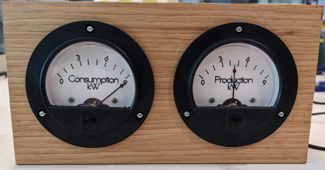
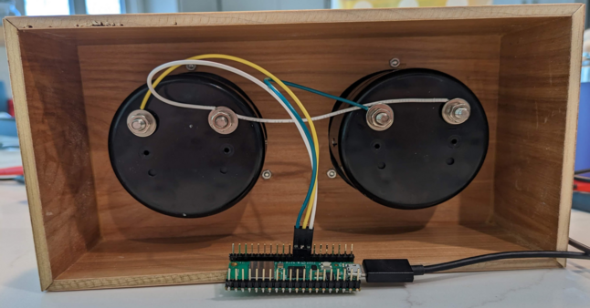

# analoguEnvoy
This project contains three variations of scripts that can display Solar Production and Power Consumption as measured by an Enphase Envoy Communications Gateway.  

## Python MQTT
[solar.py](/pythonMQTT/solar.py) connectes to an MQTT server and subscribes to production and consumption messages published by [homeassistant](https://www.home-assistant.io/) and collected by a [custom envoy integration](https://github.com/briancmpbll/home_assistant_custom_envoy). This variation was developed on a Raspberry Pi Zero W.

## Python http
[solar.py](/python/solar.py) reads [settings.json](/python/settings.example.json) for a username, password and serial number. It then obtains a token from `enlighten` and uses it to query `envoy` locally for consumption and production information. This variotaion was developed on a Raspberry Pi 4, but it would run fine on a Zero W.

## CircutPython http
Written in [CircutPython](https://circuitpython.org/), [code.py](/circutpython/code.py) reads [settings.toml](/circutpython/settings.toml) for an ssid and password to make a wifi connecton. Simiar to the python version your username, password and serial number are used to obtain a token from `enlighten` which is used to query `envoy` locally for consumption and producion information. This variation was developed on a [Raspberry Pi Pico W](https://www.raspberrypi.com/documentation/microcontrollers/raspberry-pi-pico.html#raspberry-pi-pico-w-and-pico-wh).

## PWM
All three versions use PWM to drive analogue gauges with a 3v range.

## Meters
I have been using [this 15v meter from Amazon](https://www.amazon.com/Baomain-Analogue-Voltage-Analog-Voltmeter/dp/B06XXM74SC/) and converting them to 3v range by swapping out the internal 15kΩ resistor with a 3kΩ resistor.

## Custom Face
[face.svg](./face/face.svg) is a bitmap to vector conversion of a screenshot of the designed I used in Cricut Design Space. Not ideal, but it should give you a place to start. (I could not find a way to directly export from Design Space.)

# 

